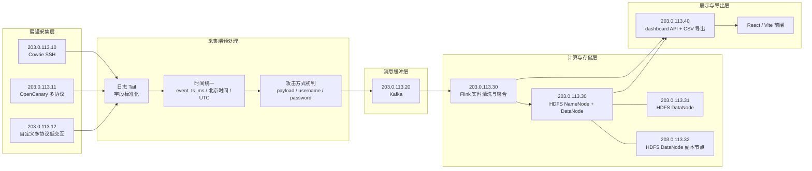

# 多源威胁情报大数据实时网络安全态势感知系统

一个基于多源蜜罐日志的大数据安全态势感知系统。系统从 SSH、HTTP、VNC、Telnet、数据库、Redis、MQTT、SMB 等协议入口采集攻击行为，在蜜罐侧完成轻量预处理，经 Kafka/Flink/HDFS 链路形成历史明细、实时窗口和聚合快照，最后由 React 前端展示态势总览、攻击分析、源 IP 画像和数据导出。

线上前端：[https://example.invalid/](https://example.invalid/)

代码阅读与服务器部署说明：[实践代码说明.md](实践代码说明.md)

## 功能概览

- **态势总览**：展示历史所有事件、实时窗口事件、外部攻击源 IP、在线蜜罐、全球攻击流向和最新攻击事件。
- **攻击分析**：优先按攻击方式归类，而不是只按协议展示；支持弱口令爆破、HTTP 指纹探测、SQL 注入探测、Web 漏洞扫描、恶意载荷下载、数据库探测等行为统计。
- **源 IP 画像**：基于历史日志构建 IP-IP 关系图，只绘制攻击 IP 节点和相似行为边，支持搜索、点击节点、社群高亮、关联证据和画像详情。
- **系统与导出**：支持按全部、24 小时、7 天、30 天或自定义时间范围导出；攻击事件 CSV 字段可自由选择并拖拽排序。
- **真实数据接入**：前端读取后端发布的 `dashboard.json`、`dashboard-live.json` 和导出接口，不依赖静态模拟数据。
- **运行状态探针**：前端服务器通过只读健康探针检查 Kafka、Flink、HDFS 状态，避免仅凭页面静态文案判断链路正常。

## 当前架构



## 服务器职责

| 服务器 | 当前角色 | 主要职责 |
| --- | --- | --- |
| `203.0.113.10` | Cowrie SSH 蜜罐 | 采集 SSH 连接、登录、会话和命令输入日志 |
| `203.0.113.11` | OpenCanary 多协议蜜罐 | 采集 HTTP、VNC、Telnet、Redis、数据库等探测事件 |
| `203.0.113.12` | 自定义多协议低交互蜜罐 | 采集多协议连接、端口探测、payload 和异常输入 |
| `203.0.113.20` | Kafka 日志缓冲节点 | 接收采集端预处理日志，承担消息队列缓冲 |
| `203.0.113.30` | Flink / Hadoop 主节点 | 运行 Flink、HDFS NameNode、HDFS DataNode 和聚合任务 |
| `203.0.113.31` | HDFS DataNode | 承担 HDFS 副本和存储扩展 |
| `203.0.113.32` | HDFS DataNode 副本节点 | 资源较轻，作为第三 DataNode 参与副本存储；HDFS 端口仅允许集群内网访问，不建议作为 Kafka/Flink 主节点 |
| `203.0.113.40` | 前端与 API 服务 | 部署 React 页面、静态 API、CSV 导出和运行状态健康探针 |

## 数据流

1. 蜜罐节点持续监听本机日志新增行，保留原始日志和关键字段。
2. 采集端预处理统一 `raw_time`、`event_time_utc`、`event_time_beijing`、`event_ts_ms`、源 IP、目标端口、协议和攻击方式。
3. 预处理后的 JSONL 进入 Flume / Kafka 链路，由 Kafka 作为消息缓冲。
4. Flink 消费 Kafka，生成实时清洗流、窗口统计和聚合结果。
5. HDFS 按时间分区保留历史明细，支撑全量 CSV 导出和离线统计。
6. 前端服务器发布：
   - `dashboard.json`：历史聚合快照
   - `dashboard-live.json`：秒级实时窗口
   - `dashboard-batch.json`：批处理补充快照
   - `/api/export/events.csv`：历史事件 CSV 全量导出，由前端服务器代理到 HDFS DWD 只读导出 API
   - `/api/runtime-health.json`：Kafka/Flink/HDFS 健康探针

## 前端页面

| 页面 | 路由参数 | 说明 |
| --- | --- | --- |
| 态势总览 | `?view=overview` 或默认 | KPI、全球攻击流向、实时事件流、蜜罐状态和源 IP 排行 |
| 攻击分析 | `?view=threat-analysis` | 攻击方式统计、趋势、协议背景、风险行为和分析素材 |
| 源 IP 画像 | `?view=source-profile` | IP 关系图、攻击社群、节点详情、关联证据和搜索 |
| 系统与导出 | `?view=system-export` | CSV 字段配置、全量导出、导出任务、数据来源和运行状态 |

筛选条件会同步到 URL，包括协议、攻击方式、高危筛选、地图时间范围、排序模式和选中 IP，便于复现分析视角。

## 攻击方式归类

前端和预处理逻辑会把协议事件进一步归类为攻击方式，避免界面只显示 `SSH`、`HTTP`、`VNC` 这类粗粒度协议。

当前主要攻击方式包括：

| 攻击方式 | 典型证据 |
| --- | --- |
| SSH 弱口令爆破 | SSH 登录、认证失败、用户名/密码字段 |
| VNC 密码爆破 | VNC challenge/response、VNC password 判断 |
| Telnet 弱口令爆破 | Telnet 登录和口令尝试 |
| HTTP 指纹探测 | `GET /`、Host、User-Agent、路径访问 |
| HTTP 代理探测 | CONNECT、代理转发测试 |
| SQL 注入探测 | `union select`、`information_schema`、`sleep()`、`or 1=1` 等特征 |
| Web 漏洞扫描 | 管理后台、敏感文件、CVE/CGI、命令参数探测 |
| 数据库服务探测 | MySQL/PostgreSQL/MSSQL/Oracle/MongoDB 连接或握手 |
| Redis 命令探测 | INFO、AUTH、CONFIG、SET、SLAVEOF 等命令 |
| 恶意载荷下载 | wget、curl、tftp、chmod、shell 下载执行链 |

## 源 IP 画像图

源 IP 画像页基于历史事件生成 IP 关系图：

- 节点只表示攻击源 IP。
- 边表示两个 IP 之间存在相似攻击行为、目标、时间窗口、账号口令、ASN、地理位置或网段特征。
- 点击 IP 节点只做高亮和详情展示，不过滤全图节点。
- 点击攻击社群后，该社群节点互斥排布，便于观察同族 IP。
- 关联证据来自当前日志计算结果，不使用固定静态样例。

### 关联算法

当前实现位于 `frontend/src/App.jsx` 的 `buildIpAttributionGraph()`、`buildIpProfiles()`、`scoreIpSimilarity()`、`buildFamilyCommunityLinks()` 和 `detectIpCommunities()`。算法不是静态样例，而是前端基于当前 dashboard 中的历史事件窗口实时计算。

对每个源 IP \(ip_i\) 构建行为画像：

```math
P_i = \{ f_1, f_2, f_3, ..., f_n \}
```

其中每个特征 \(f\) 来自多维日志字段：

```math
f \in \{
攻击方式,\ 协议,\ 目标端口,\ 目标蜜罐,\ 时间窗口,\ 用户名密码,\ ASN,\ ISP,\ 地理位置,\ 网段,\ Payload特征
\}
```

实际实现中，每个 IP 的画像包含以下特征 Map。Map 内部保存的是“特征值 -> 该特征值出现权重”：

| 特征 Map | 含义 | 单事件写入权重 |
| --- | --- | --- |
| `protocols` | 协议背景，例如 SSH、HTTP、VNC | `1` |
| `methods` | 攻击方式，例如 SSH 弱口令爆破、HTTP 指纹探测 | `2` |
| `honeypots` | 目标蜜罐节点 | `1` |
| `eventTypes` | 原始事件类型 | `1` |
| `ports` | 源端口或目标端口 | `1` |
| `stages` | 攻击阶段 | `1` |
| `timeBuckets` | 时间窗口，小时桶和 10 分钟桶 | 小时桶 `1`，10 分钟桶 `0.7` |
| `patterns` | 复合攻击模式 | `method|hour` 为 `2`，`method|stage` 为 `2`，`method|protocol|port` 为 `2` |
| `credentials` | 用户名/密码组合 | `2` |
| `commands` | 命令输入 | `3` |
| `payloadTokens` | payload、命令、raw、detail 中抽取的 token | `1` |
| `netblocks` | IPv4 `/24` 网段 | `1` |

payload token 会忽略过于泛化的词，例如 `connection`、`attempt`、`password`、`unknown`、`http`、`host`、`user-agent`、`mozilla`、`curl`、`wget` 等；每条事件最多取 16 个 token，token 最大长度为 64。

对于特征 Map 中的每个特征值 \(v\)，先计算 IDF 稀有度：

```math
idf(v) = \ln\frac{N+1}{df(v)+1} + 1
```

其中 \(N\) 为参与画像计算的 IP 数，\(df(v)\) 为包含该特征值的 IP 数。

两个 IP 在单个特征维度 \(k\) 上使用带 IDF 的加权 Jaccard：

```math
J_k(ip_i, ip_j) =
\frac{
\sum_{v \in P_{i,k} \cup P_{j,k}}
\min(x_{i,k,v}, x_{j,k,v}) \cdot idf_k(v)
}{
\sum_{v \in P_{i,k} \cup P_{j,k}}
\max(x_{i,k,v}, x_{j,k,v}) \cdot idf_k(v)
}
```

其中 \(x_{i,k,v}\) 表示 IP \(ip_i\) 在特征维度 \(k\) 上特征值 \(v\) 的累计权重。

最终相似度使用 14 个特征维度加权求和。项目当前实际权重如下：

| 维度 | 代码字段 | 总相似度权重 |
| --- | --- | ---: |
| 攻击模式 | `patterns` | `30` |
| 命令输入 | `commands` | `28` |
| 攻击方式 | `methods` | `26` |
| 账号口令 | `credentials` | `26` |
| Payload 特征 | `payloadTokens` | `24` |
| 时间窗口 | `timeBuckets` | `18` |
| 事件类型 | `eventTypes` | `15` |
| 攻击阶段 | `stages` | `13` |
| 同网段 | `netblocks` | `11` |
| 目标蜜罐 | `honeypots` | `10` |
| 端口 | `ports` | `10` |
| 协议背景 | `protocols` | `4` |
| ASN 完全一致 | `asn` | `3` |
| ISP 完全一致 | `isp` | `2` |

总权重为：

```math
W = 30 + 28 + 26 + 26 + 24 + 18 + 15 + 13 + 11 + 10 + 10 + 4 + 3 + 2 = 220
```

ASN 和 ISP 使用精确匹配：

```math
I_{asn}(ip_i, ip_j) =
\begin{cases}
1, & asn_i = asn_j\ 且\ asn_i\ 已知 \\
0, & otherwise
\end{cases}
```

```math
I_{isp}(ip_i, ip_j) =
\begin{cases}
1, & isp_i = isp_j\ 且\ isp_i\ 已知 \\
0, & otherwise
\end{cases}
```

最终关联分为：

```math
Score(ip_i, ip_j) =
round\left(
100 \times
\frac{
30J_{patterns}
+ 28J_{commands}
+ 26J_{methods}
+ 26J_{credentials}
+ 24J_{payloadTokens}
+ 18J_{timeBuckets}
+ 15J_{eventTypes}
+ 13J_{stages}
+ 11J_{netblocks}
+ 10J_{honeypots}
+ 10J_{ports}
+ 4J_{protocols}
+ 3I_{asn}
+ 2I_{isp}
}{220}
\right)
```

取值范围：

```math
0 \le Score(ip_i, ip_j) \le 100
```

为避免全量两两比较带来的性能问题，项目先通过候选特征生成候选 IP 对。候选对生成规则如下：

| 候选维度 | 代码字段 | 候选权重 | 单特征最大 fanout |
| --- | --- | ---: | ---: |
| 攻击模式 | `patterns` | `30` | `220` |
| 攻击方式 | `methods` | `26` | `180` |
| 目标蜜罐 | `honeypots` | `10` | `90` |
| 事件类型 | `eventTypes` | `15` | `110` |
| 账号口令 | `credentials` | `26` | `180` |
| 命令输入 | `commands` | `28` | `180` |
| Payload 特征 | `payloadTokens` | `24` | `150` |
| 端口 | `ports` | `10` | `120` |
| 攻击阶段 | `stages` | `13` | `150` |
| 时间窗口 | `timeBuckets` | `18` | `220` |
| 同网段 | `netblocks` | `11` | `80` |

候选对的累计分为：

```math
Candidate(ip_i, ip_j) +=
W_k \cdot idf_k(v) \cdot \min(2,\min(x_{i,k,v},x_{j,k,v}))
```

候选对按该分数排序，只保留前 `12000` 个；另外对综合排名最高的前 `220` 个 IP 做兜底两两比较。两部分候选合并去重后最多保留 `16000` 个 IP 对进入最终评分。

最终边过滤使用项目中的真实阈值：

```math
E_{ij} =
\begin{cases}
1, & Score(ip_i, ip_j) \ge 24,\ |\mathcal{Evidence}_{ij}| \ge 2,\ B_{ij}=1 \\
0, & otherwise
\end{cases}
```

其中行为证据条件为：

```math
B_{ij} =
\begin{cases}
1, & StrongEvidenceCount_{ij} > 0\ 或\ Score(ip_i, ip_j) \ge 42 \\
0, & otherwise
\end{cases}
```

证据项选择规则：

- 单维特征分数 \(J_k \ge 0.14\)，或 ASN/ISP 完全一致时，才进入候选证据。
- 证据按 `单维分数 × 维度权重` 排序。
- 每条边最多保留前 `4` 个证据项。
- 强证据维度包括：`patterns`、`methods`、`eventTypes`、`credentials`、`commands`、`payloadTokens`、`ports`、`netblocks`。
- `StrongEvidenceCount` 统计强证据中证据分数不低于 `18` 的数量。

置信度分级：

```math
Confidence =
\begin{cases}
high, & Score \ge 58\ 且\ StrongEvidenceCount \ge 2 \\
medium, & Score \ge 36\ 且\ StrongEvidenceCount \ge 1 \\
low, & otherwise
\end{cases}
```

社群边还会进一步过滤，避免图上边过多。项目定义家庭证据和上下文证据：

```text
FamilyEvidence = {credentials, commands, payloadTokens, netblocks, asn, isp}
ContextEvidence = {methods, protocols, honeypots, eventTypes, ports, stages, timeBuckets}
```

用于攻击族群划分的边满足以下任一条件：

```math
\begin{aligned}
&Score \ge 52 \land FamilyCount \ge 1 \land ContextCount \ge 1 \\
or\quad &Score \ge 46 \land FamilyCount \ge 2 \\
or\quad &Score \ge 44 \land FamilyCount \ge 1 \land ContextCount \ge 2 \\
or\quad &Score \ge 42 \land credentials \land payloadTokens \land methods \\
or\quad &Score \ge 44 \land netblocks \land (methods \lor eventTypes \lor timeBuckets)
\end{aligned}
```

社群边排序分为：

```math
FamilyRank = Score + 9 \cdot FamilyCount + 2 \cdot ContextCount + 4 \cdot StrongEvidenceCount
```

每个 IP 最多保留 `4` 条高排名社群边；如果一条边是两端 IP 的共同 Top 边，或满足强桥接条件：

```math
Score \ge 58 \land StrongEvidenceCount \ge 2
```

则保留为社群计算边。

最终得到源 IP 关系图：

```math
G = (V, E)
```

其中：

```math
V = \{ ip_1, ip_2, ..., ip_n \}
```

社群划分采用基于边权的标签传播式迭代：

- 只使用 `Score >= 26` 的边参与邻居投票。
- 每个节点初始属于自身社群。
- 邻居投票权重为 `max(1, Score)`。
- 当前社群有初始保留分 `2`。
- 最多迭代 `10` 轮。
- 当最佳社群得分比当前社群得分高 `4` 以上时，节点切换到最佳社群。

因此，同一社群表示这些 IP 在攻击方式、目标、时间窗口、账号口令、ASN、ISP、网段或 payload 等特征上存在较强相似性，可作为疑似同源攻击基础设施或同一扫描任务进行分析。边表示“行为相似导致的疑似关联”，不直接等价于同一个真实攻击者。

## API 约定

| 接口 | 用途 |
| --- | --- |
| `/api/dashboard.json` | 历史聚合快照，提供总量、趋势、源 IP、攻击方式、蜜罐状态和事件窗口 |
| `/api/dashboard-live.json` | 秒级 live 快照，提供最近窗口事件、采集状态和实时延迟 |
| `/api/dashboard-batch.json` | 离线批处理补充快照 |
| `/api/export/events.csv` | 按时间、协议、攻击方式和字段配置导出历史事件 CSV；47 前端服务器代理 38 HDFS DWD 只读导出 API |
| `/api/runtime-health.json` | 只读探测 Kafka、Flink、HDFS 是否可用 |

`/api/runtime-health.json` 当前检查项：

| 服务 | 检查方式 |
| --- | --- |
| Kafka | systemd 状态、`9092` 监听 |
| Flink | standalone 服务、stream job、REST `/jobs`、JVM 进程 |
| HDFS | NameNode JMX、live DataNode 数、`8020` 监听、JVM 进程 |

## 关键目录

| 路径 | 说明 |
| --- | --- |
| `frontend/src/App.jsx` | 前端主界面、筛选、地图、关系图、导出和页面布局 |
| `frontend/src/services/threatApi.js` | dashboard/live/runtime-health 的拉取、合并和标准化 |
| `frontend/server/honeypot_static_server.py` | 前端静态服务、CSV 全量导出接口、运行状态健康探针 |
| `frontend/server/honeypot_flink_hdfs_sync.sh` | Flink/HDFS 同步脚本副本 |
| `infra/honeypot_edge_preprocessor.py` | 蜜罐侧日志监听和轻量预处理 |
| `infra/honeypot_kafka_stream_consumer.py` | Kafka 消费并写入日志流明细 |
| `infra/preprocess_honeypot_logs.py` | 批量清洗、攻击方式推断和 dashboard 生成 |
| `infra/honeypot_live_dashboard.py` | 秒级 live dashboard 发布 |
| `infra/honeypot_realtime_dashboard.py` | 定时历史 dashboard 发布 |
| `infra/setup_kafka_kraft.sh` | Kafka KRaft 安装和 topic 初始化 |
| `infra/setup_hadoop_distributed_cluster.sh` | Hadoop/HDFS 分布式集群安装 |
| `infra/*.service` | systemd 服务模板 |

## 本地开发

```bash
cd frontend
npm install
npm run dev
```

默认开发地址：

```text
http://localhost:5173/
```

生产构建：

```bash
cd frontend
npm run build
```

## 线上部署

前端构建产物部署到：

```text
203.0.113.40:/opt/honeypot-cybermap-frontend/dist
```

前端静态服务由 systemd 管理：

```text
honeypot-cybermap-frontend.service
```

服务模板在：

```text
infra/honeypot-cybermap-frontend.service
```

## 数据导出

系统与导出页支持：

- 攻击事件 CSV：支持自定义时间范围和字段拖拽排序。
- 源 IP 列表 TXT：导出全量去重源 IP。
- 源 IP 画像 CSV：导出 IP、地理位置、ASN、事件数和风险分。
- 攻击方式聚合 CSV：导出攻击方式、策略、源 IP 数和事件数。
- 蜜罐节点 CSV：导出节点事件数、IP 数和 HDFS 分区信息。
- 分析摘要 MD：导出统计结论和报告素材。
- 统计快照 JSON：导出当前统计状态和全量 IP 画像。

CSV 明细优先走后端全量历史日志；如果历史明细不可读，才使用当前快照事件兜底。

## 安全约束

- 仓库不保存服务器密码、私钥、云控制台凭据和实验报告个人材料。
- 蜜罐节点只负责日志读取、轻量预处理和推送，不开放通用作业提交入口。
- Kafka、Flink、HDFS 管理端口只应允许受控节点访问，不面向公网开放。
- 前端健康探针使用只读命令检查运行状态，不修改远程服务器配置。
- 新增 DataNode 前需要同步 Hadoop workers、HDFS 配置、主机名解析和防火墙白名单。

## 当前扩展计划

- 将 `203.0.113.32` 纳入 HDFS DataNode 前，先完成 Hadoop 用户、目录、主机名解析和防火墙配置。
- 将节点清单统一到单一配置文件，减少 README、前端常量、systemd 和部署脚本之间的重复配置。
- 后续可把 CSV 导出、健康探针和 dashboard 发布进一步拆成独立 API 服务，降低前端静态服务职责。
